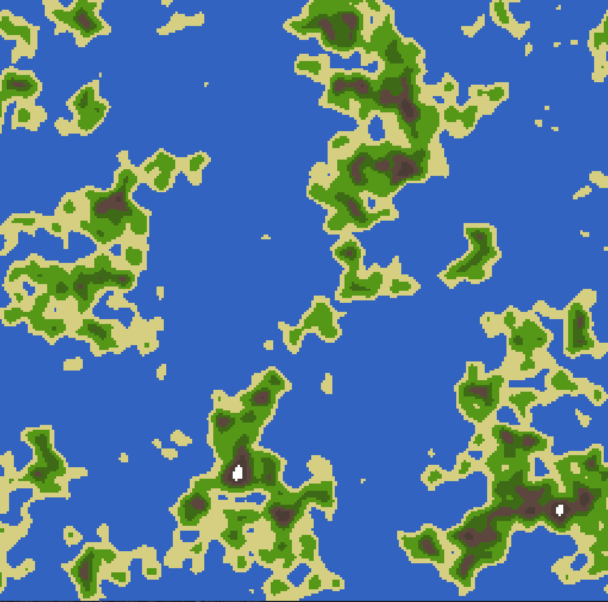
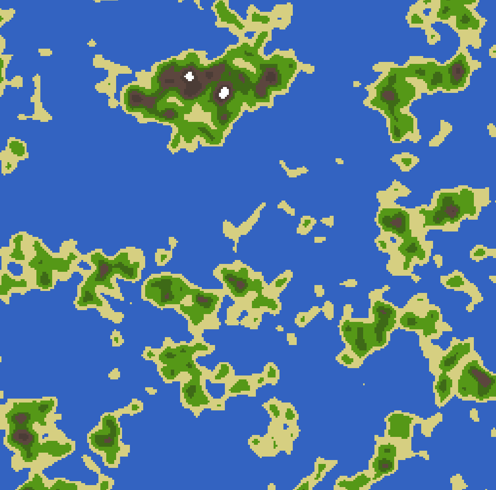
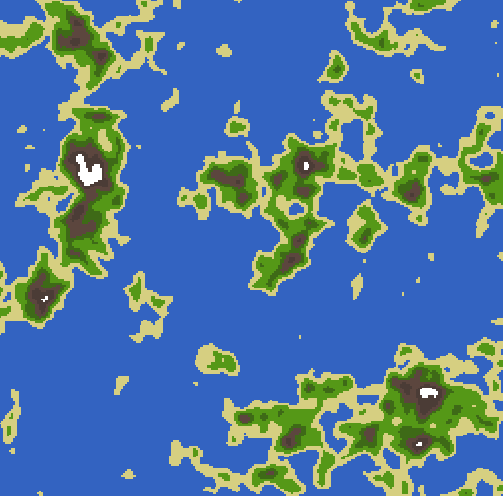

# Terrain Generator

Simple terrain generation implementation using usign Perlin noise (https://en.wikipedia.org/wiki/Perlin_noise)


## Compilation and usage
A Cmake script is provided for generating build scripts, for linux usage is simple, just follow the steps below
```bash
hello@x ~ mkdir -p bin && cd bin
hello@x ~ cmake ..
hello@x ~ make && ./terrain
```
Ensure that before compiling SFML is already installed on your machine.

## Sample generations
Here is just a bunch of sample terrain generated by the script:








